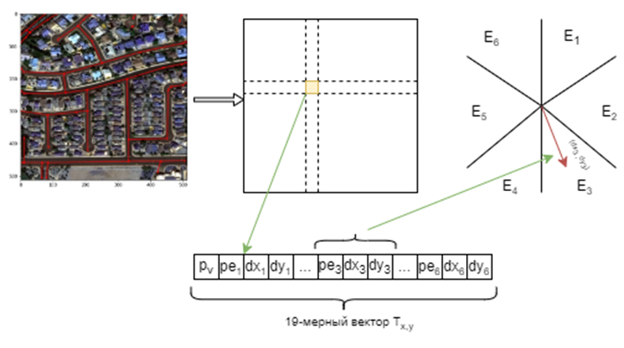

# RoadGraphExtraction

Road graph extraction using neural networks and graph tensor encoding



## Training

```
python3 model/train.py --image-size 512 \
                       --load-model PATH_TO_MODEL \
                       --save-model PATH_TO_MODEL \
                       --epochs 50 \
                       --steps-per-epoch 500 \
                       --train-dataset DATASET_1_CSV \
                       --train-dataset DATASET_2_CSV
```

All paths to images and annotations of training dataset should be written in csv-file with columns: tile (for satellite images), mask (for segmentation) and graph (for using gte).
Graphs are expected to be represented as pickle dump of python dictionary:
```
graph = {
  (u1, v1): {(u2, v2), (u3, v3)},
  (u2, v2): {(u1, v1), (u3, v3)},
  (u3, v3): {(u1, v1), (u2, v2)}
}

pickle.dump(open('path_to_graph.p', 'wb'))
```

## Infer

TODO

## Links

[Sat2Graph: Road Graph Extraction
through Graph-Tensor Encoding](https://arxiv.org/pdf/2007.09547.pdf)

[Road graph extraction using segmentaion and skeleton network](https://github.com/snakers4/spacenet-three)

[APLS](https://github.com/CosmiQ/apls)

[TOPO](https://citeseerx.ist.psu.edu/viewdoc/download?doi=10.1.1.423.1517&rep=rep1&type=pdf)
